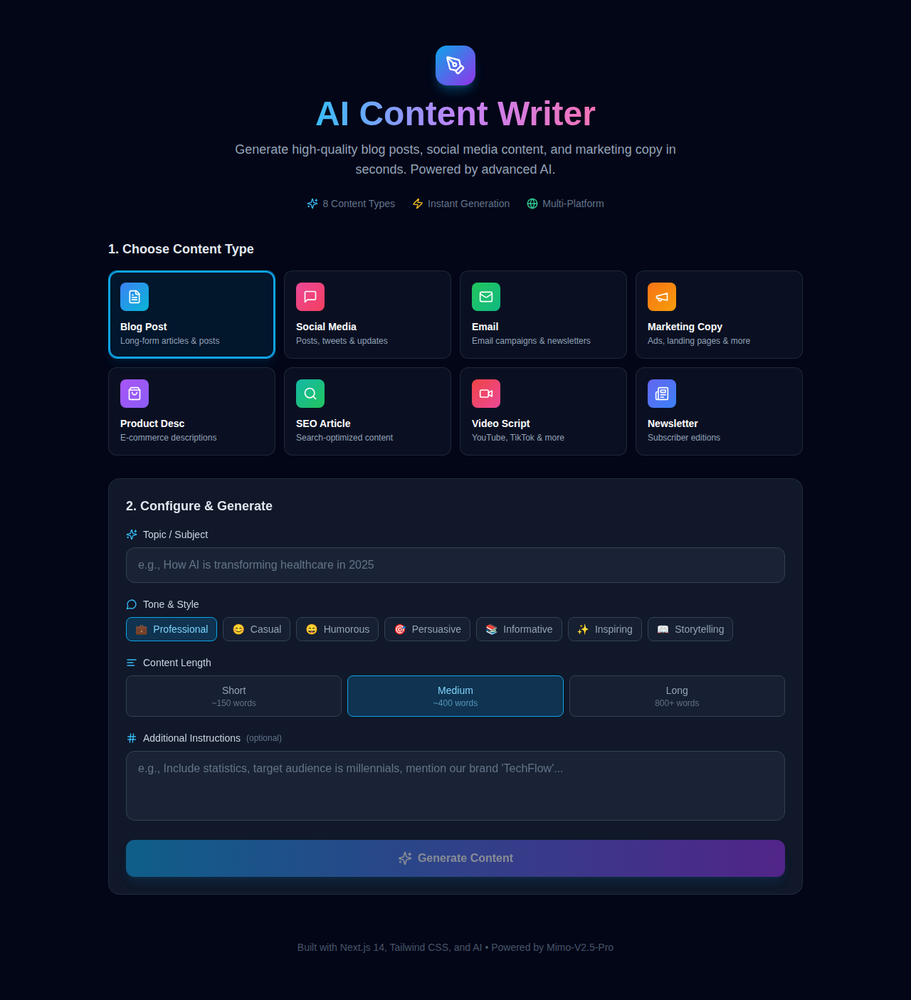

# AI Agent App - Powered by Mimo v2.5 Pro

## Dashboard Preview



---

# AI Content Writer

A beautiful, modern AI content generation app powered by **Mimo v2.5 Pro**. Generate high-quality content for blogs, social media, emails, and more with customizable tones and styles.

   

## ✨ Features

- **Multiple Content Types**: Blog Posts, Twitter Threads, LinkedIn Posts, Emails, YouTube Scripts, Product Descriptions
- **Tone Customization**: Professional, Casual, Funny, Persuasive, Informative
- **Word Count Control**: Adjustable slider for content length
- **Beautiful UI**: Modern gradient design with smooth animations
- **Copy to Clipboard**: One-click content copying
- **Download as TXT**: Save content as text files
- **Content History**: Track and revisit generated content
- **Mobile Responsive**: Works perfectly on all devices
- **Powered by Mimo v2.5 Pro**: State-of-the-art AI model

## 🚀 Quick Start

### Prerequisites

- Node.js 18+ 
- npm or yarn
- Mimo API Key

### Installation

1. Clone the repository:
```bash
git clone https://github.com/yourusername/ai-content-writer.git
cd ai-content-writer
```

2. Install dependencies:
```bash
npm install
```

3. Set up environment variables:
```bash
cp .env.example .env.local
```

Edit `.env.local` and add your Mimo API key:
```
MIMO_API_KEY=your_mimo_api_key_here
```

4. Run the development server:
```bash
npm run dev
```

5. Open [http://localhost:3000](http://localhost:3000) in your browser.

## 🎨 Content Types

| Type | Description |
|------|-------------|
| **Blog Post** | Long-form articles with SEO optimization |
| **Twitter Thread** | Engaging multi-tweet threads |
| **LinkedIn Post** | Professional networking content |
| **Email** | Business and marketing emails |
| **YouTube Script** | Video scripts with hooks and CTAs |
| **Product Description** | Compelling product copy |

## 🎭 Tones

- **Professional**: Formal business communication
- **Casual**: Friendly, conversational style
- **Funny**: Humorous and entertaining
- **Persuasive**: Convincing and action-oriented
- **Informative**: Educational and fact-based

## 🛠 Tech Stack

- **Framework**: Next.js 14 (App Router)
- **Language**: TypeScript
- **Styling**: Tailwind CSS
- **AI Model**: Mimo v2.5 Pro
- **Deployment**: Vercel-ready

## 📦 Project Structure

```
ai-content-writer/
├── src/
│   ├── app/
│   │   ├── api/
│   │   │   └── generate/
│   │   │       └── route.ts
│   │   ├── globals.css
│   │   ├── layout.tsx
│   │   └── page.tsx
│   ├── components/
│   │   ├── ContentHistory.tsx
│   │   ├── ContentPreview.tsx
│   │   ├── ContentTypeSelector.tsx
│   │   ├── GenerateButton.tsx
│   │   ├── Header.tsx
│   │   ├── Sidebar.tsx
│   │   ├── ToneSelector.tsx
│   │   ├── TopicInput.tsx
│   │   └── WordCountSlider.tsx
│   └── lib/
│       └── prompts.ts
├── .env.example
├── .gitignore
├── README.md
├── next.config.js
├── package.json
├── postcss.config.js
├── tailwind.config.ts
└── tsconfig.json
```

## 🚀 Deployment

### Vercel (Recommended)

1. Push your code to GitHub
2. Import project on [Vercel](https://vercel.com)
3. Add environment variable `MIMO_API_KEY`
4. Deploy!

### Manual Deployment

```bash
npm run build
npm start
```

## 📝 Environment Variables

| Variable | Description | Required |
|----------|-------------|----------|
| `MIMO_API_KEY` | Your Mimo v2.5 Pro API key | Yes |

## 🤝 Contributing

1. Fork the repository
2. Create your feature branch (`git checkout -b feature/amazing-feature`)
3. Commit your changes (`git commit -m 'Add amazing feature'`)
4. Push to the branch (`git push origin feature/amazing-feature`)
5. Open a Pull Request

## 📄 License

This project is licensed under the MIT License - see the [LICENSE](LICENSE) file for details.

## 🙏 Acknowledgments

- Built with [Next.js](https://nextjs.org/)
- Styled with [Tailwind CSS](https://tailwindcss.com/)
- Powered by [Mimo v2.5 Pro](https://mimo.ai)

---

Made with ❤️ and AI
